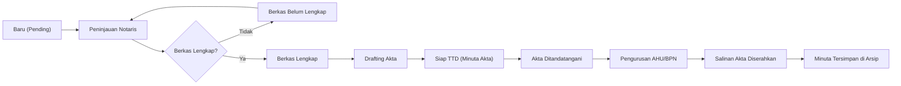

# 🏢 Noffice — Demo Walkthrough

> **Sistem Manajemen Terpadu Kantor Notaris & PPAT (Offline-First + Local AI)**
> Versi `0.1.0` • React 18 + Vite + Express.js + SQLite + Local AI Engine

---

## 📋 Ringkasan Proyek

**Noffice** adalah aplikasi manajemen kantor Notaris & PPAT yang beroperasi **100% offline** (On-Premise). Seluruh data klien, berkas, dan naskah akta tersimpan di komputer lokal tanpa koneksi internet/cloud.

### Tech Stack
| Komponen | Teknologi |
|---|---|
| **Frontend** | React 18, Vite 5, Custom Premium CSS (Glassmorphic Design) |
| **Backend** | Node.js, Express.js (port `3001`) |
| **Database** | SQLite 3 (`server/database.sqlite`) |
| **AI Engine** | Local Notary AI Engine (Built-in NLP + Ollama API) |
| **Security** | PBKDF2 Password Hashing |
| **Styling** | Plus Jakarta Sans, Glassmorphism, Dark/Light Mode |

---

## 🔐 Halaman 1: Login (`/login`)

**File**: [Login.jsx](file:///c:/Hasboy/All_Project/Noffice/src/pages/Login.jsx)

### Tampilan
- Halaman login dengan desain glassmorphic card di tengah layar
- Logo **Noffice** dengan ikon kotak dan teks "Selamat Datang Kembali"
- Form input: **Email** dan **Kata Sandi**
- Tombol **"Masuk"** (primary button, full-width)
- Demo account credentials ditampilkan di bawah form

### Akun Demo

| Peran | Email | Password | Akses |
|---|---|---|---|
| 🏛️ **Notaris (Admin)** | `admin@noffice.com` | `admin` | Akses Penuh |
| 👨‍💼 **Karyawan (Staff)** | `karyawan@noffice.com` | `user` | Akses Operasional |

### Alur
1. Isi email & password → klik **Masuk**
2. Autentikasi via backend API (`POST /api/auth/login`)
3. Jika berhasil → redirect ke `/dashboard`
4. Jika gagal → toast notification error
5. Protected routes: semua halaman selain `/login` membutuhkan autentikasi

---

## 📊 Halaman 2: Dashboard (`/dashboard`)

**File**: [Dashboard.jsx](file:///c:/Hasboy/All_Project/Noffice/src/pages/Dashboard.jsx)

### Layout & Fitur

#### 🎯 Welcome Block
- Menampilkan **tanggal hari ini**
- Sapaan personal: **"Selamat datang, [Nama User]"**
- Deskripsi: *"Sistem Manajemen Kantor Notaris & PPAT 100% offline..."*
- Quick action buttons: **Permohonan Akta** dan **Tambah Klien**

#### 📈 Statistik Cards (4 kolom)
| Card | Ikon | Info |
|---|---|---|
| **Kasus Aktif** (blue) | 📄 | Jumlah permohonan aktif + total |
| **Total Klien** (green) | 👤 | Jumlah klien di database |
| **Dokumen** (violet) | 📁 | Total dokumen tersimpan |
| **Menunggu Persetujuan** (amber, admin) | ⏰ | Permohonan pending approval |

> [!NOTE]
> Untuk akun **Karyawan**, card ke-4 berubah menjadi **"Mesin AI — Siap"** menunjukkan status AI engine.

#### ⚡ Quick Operations (4 tombol)
- **Permohonan Baru** → navigasi ke `/cases` + buka modal create
- **Tambah Klien** → navigasi ke `/clients` + buka modal create
- **Unggah Dokumen** → buka Upload Modal
- **Kelola Staff** (admin) / **Kotak Masuk** (staff)

#### 📋 Panel Kiri: Permohonan Akta Terbaru
- Tabel dengan kolom: **Permohonan**, **Klien**, **Status**
- Menampilkan 5 permohonan terbaru
- Klik baris → navigasi ke `/cases`
- Empty state jika belum ada data

#### 📋 Panel Kiri: Dokumen Terbaru
- Daftar 4 dokumen terbaru dengan ikon tipe file
- Info: nama, author, departemen, ukuran
- Badge status dokumen

#### 📋 Panel Kanan: Agenda Penandatanganan Akta
- Jadwal kehadiran klien untuk TTD
- Informasi: jenis layanan, nama klien, tanggal & waktu
- Empty state: "Belum Ada Jadwal TTD"

#### 📋 Panel Kanan: Kategori Dokumen
- Bar chart horizontal menunjukkan distribusi dokumen per kategori

#### 📋 Panel Kanan: AI Notaris Lokal
- Status: **"Siap & Aman 100% Offline"**
- Tombol **"Buka AI Copilot"** → membuka AI Copilot drawer

---

## 👥 Halaman 3: Klien (`/clients`)

**File**: [Clients.jsx](file:///c:/Hasboy/All_Project/Noffice/src/pages/Clients.jsx)

### Fitur Utama

#### 📝 Daftar Klien
- Tabel dengan search/filter
- Kolom: **Avatar**, **Nama**, **NIK**, **Telepon** (masked: `0812••••5678`), **Lokasi** (singkat), **Total Kasus**
- Klik baris → buka detail klien

#### ➕ Tambah Klien Baru (Modal)
Form fields:
- **NIK** (16 digit) — validasi panjang
- **Nama Lengkap**
- **Tanggal Lahir**
- **No. Telepon**
- **Email**
- **Pekerjaan**
- **Alamat Lengkap**

#### 🤖 AI Data Extractor (KTP/OCR)
> **Killer Feature #1**: Cukup salin teks hasil scan KTP, AI otomatis mengisi NIK 16-digit, Nama, dan Alamat ke formulir dalam 1 detik!

- Tombol **"🤖 AI Data Extractor"** di dalam modal tambah klien
- Textarea untuk paste teks OCR hasil scan KTP
- AI engine mengekstrak: NIK, Nama, Tempat/Tgl Lahir, Alamat, Pekerjaan
- Auto-fill ke form fields
- Mencegah kesalahan ketik fatal pada NIK 16 digit

#### ✏️ Edit & Hapus Klien
- Edit: buka modal pre-filled dengan data klien
- Hapus: konfirmasi dialog → soft delete

---

## 📜 Halaman 4: Permohonan Akta / Cases (`/cases`)

**File**: [Cases.jsx](file:///c:/Hasboy/All_Project/Noffice/src/pages/Cases.jsx)

### Halaman Terpenting — Alur Kerja End-to-End

#### 📋 Daftar Permohonan
- Filter berdasarkan **Status** dan **Jenis Layanan**
- Search global
- Daftar card/row per permohonan

#### ➕ Buat Permohonan Baru (Modal)
Form fields:
- **Klien** (dropdown dari daftar klien)
- **Jenis Layanan** (dropdown):

| ID | Jenis Layanan |
|---|---|
| `AJB` | Akta Jual Beli (AJB) |
| `AKT-PT` | Pendirian PT / CV / Yayasan |
| `HIBAH` | Akta Hibah |
| `WARIS` | Surat Keterangan Waris (SKW) |
| `KUASA` | Surat Kuasa / Akta Kuasa |
| `PERJANJIAN` | Akta Perjanjian / Kontrak / Kredit |
| `ROYA` | Roya / Pelunasan Hak Tanggungan |
| `LAINNYA` | Layanan Notaris Lainnya |

- **Penanggung Jawab** (auto-fill nama user)
- **Estimasi Selesai**
- **Catatan**
- **Checklist Berkas Otomatis** — setiap jenis layanan punya default checklist (misal AJB: KTP, KK, Sertifikat, PBB, dll.)

#### 🔄 Status Workflow (10 Tahapan)



#### 📋 Detail Permohonan (Panel Kanan)
Ketika klik permohonan, panel detail menampilkan:

1. **Info Umum**: Nomor referensi, jenis layanan, klien, status
2. **Checklist Berkas Interaktif**: Centang dokumen yang sudah diterima
3. **Billing & Biaya**:
   - Honorarium Notaris
   - Pajak (BPHTB/PPH)
   - PNBP
   - Status Bayar: `Belum Bayar` / `DP` / `Lunas`
4. **Jadwal TTD**: Tanggal & waktu kehadiran klien
5. **Catatan / Notes**

#### 🤖 AI Case Auditor
- Tombol **"🤖 AI Case Auditor"** di panel detail
- AI meninjau potensi risiko legal dan kewajaran pajak
- Hasil audit ditampilkan inline

#### ⚡ AI Draft Generator
- Modal terpisah [AiDraftGeneratorModal.jsx](file:///c:/Hasboy/All_Project/Noffice/src/components/AiDraftGeneratorModal.jsx)
- Input: jenis akta, pihak-pihak, objek, ketentuan khusus
- AI menyusun naskah pasal-pasal akta resmi

#### 📄 Generate Nomor Akta Otomatis
> **Killer Feature #2**: Nomor akta resmi digenerate **setelah penandatanganan**, format: `No. [Urut]/[Bulan Romawi]/[Tahun]`

- Contoh: `No. 1/IX/2026`
- Anti-ganda & terurut
- Hanya muncul saat status = `Siap TTD`

#### 🖨️ Cetak Tanda Terima (2 Jenis)
Modal cetak [PrintReceiptModal.jsx](file:///c:/Hasboy/All_Project/Noffice/src/components/PrintReceiptModal.jsx):

1. **Tanda Terima Penerimaan Berkas**: Bukti penerimaan sertifikat/KTP asli di awal
2. **Tanda Terima Penyerahan Salinan Akta**: Bukti penyerahan dokumen hasil ke klien

- Dengan Kop Notaris (nama kantor, alamat, dll.)
- Print langsung 1-klik

---

## 📂 Halaman 5: Dokumen (`/documents`)

**File**: [Documents.jsx](file:///c:/Hasboy/All_Project/Noffice/src/pages/Documents.jsx)

### Fitur

#### 📁 Folder-Based Navigation
Kategori dokumen terorganisir dalam folder:
- Akta
- Perjanjian
- Sertifikat & Dokumen Tanah
- Dokumen Klien
- Surat & Legalitas
- Dokumen Perusahaan
- Administrasi
- Lainnya

#### 📄 Daftar Dokumen per Folder
- Nama file, author, departemen, ukuran, status
- Badge status: `Approved`, `Pending`, `Rejected`

#### ⬆️ Upload Dokumen
- Modal upload [UploadModal.jsx](file:///c:/Hasboy/All_Project/Noffice/src/components/UploadModal.jsx)
- Drag & drop zone [FileDropzone.jsx](file:///c:/Hasboy/All_Project/Noffice/src/components/FileDropzone.jsx)
- Pilih kategori/folder tujuan

#### 🗑️ Trash / Sampah
- Soft delete → masuk ke Trash
- Restore atau permanent delete

---

## 📨 Halaman 6: Kotak Masuk / Inbox (`/inbox`)

**File**: [Inbox.jsx](file:///c:/Hasboy/All_Project/Noffice/src/pages/Inbox.jsx)

### Fitur
- Daftar pesan internal antar pengguna
- Status: dibaca / belum dibaca
- Compose / reply pesan

---

## 🔔 Halaman 7: Notifikasi (`/notifications`)

**File**: [Notifications.jsx](file:///c:/Hasboy/All_Project/Noffice/src/pages/Notifications.jsx)

### Fitur
- Daftar notifikasi sistem
- Status update permohonan akta
- Alert dokumen baru
- Filter: semua / belum dibaca

---

## 📊 Halaman 8: Data Tables (`/data-tables`) — 🔒 Admin Only

**File**: [DataTables.jsx](file:///c:/Hasboy/All_Project/Noffice/src/pages/DataTables.jsx)

### Fitur
- Tampilan tabel data mentah dari database
- Export CSV
- Fitur backup database 1-klik

---

## 👨‍💼 Halaman 9: Karyawan / Employees (`/employees`) — 🔒 Admin Only

**File**: [Employees.jsx](file:///c:/Hasboy/All_Project/Noffice/src/pages/Employees.jsx)

### Fitur
- Daftar staff kantor
- CRUD karyawan (Tambah, Edit, Hapus)
- Status: `Active` / `Inactive`
- Role management

---

## ⚙️ Halaman 10: Pengaturan / Settings (`/settings`)

**File**: [Settings.jsx](file:///c:/Hasboy/All_Project/Noffice/src/pages/Settings.jsx)

### 6 Tab Pengaturan

#### 🏢 General (Profil Kantor)
- Nama Kantor Notaris
- Alamat Kantor
- Nomor SK Notaris
- Logo kantor (upload)
- Timezone & Format Tanggal

#### 👤 Account (Akun Saya)
- Edit nama, email, avatar
- Update profil

#### 🔔 Notifications
- Toggle notifikasi email, push, in-app
- Preferensi alert per kategori

#### 🎨 Appearance (Tampilan)
- **Tema**: Terang / Gelap / Sistem
- Kustomisasi warna accent

#### 🌐 Language (Bahasa)
- Bahasa Indonesia (default)
- Tersedia juga English
- Sistem i18n lengkap: [i18n.js](file:///c:/Hasboy/All_Project/Noffice/src/store/i18n.js)

#### 🔒 Security (Keamanan)
- Ganti password (current → new → confirm)
- PBKDF2 hashing

---

## 🤖 Komponen AI: Copilot Drawer

**File**: [AiCopilotDrawer.jsx](file:///c:/Hasboy/All_Project/Noffice/src/components/AiCopilotDrawer.jsx)

### Fitur
- Floating button di pojok kanan bawah
- Drawer slide-in dari kanan
- Chat interface dengan AI Notaris lokal
- Konteks: bisa tanya soal hukum notaris, prosedur, regulasi
- 100% offline — menggunakan built-in NLP atau Ollama API lokal

---

## 🧭 Navigasi Aplikasi

**File**: [Sidebar.jsx](file:///c:/Hasboy/All_Project/Noffice/src/components/Sidebar.jsx) • [Topbar.jsx](file:///c:/Hasboy/All_Project/Noffice/src/components/Topbar.jsx)

### Sidebar (Menu Utama)
| Menu | Ikon | Route | Akses |
|---|---|---|---|
| Dashboard | 📊 | `/dashboard` | Semua |
| Klien | 👤 | `/clients` | Semua |
| Permohonan | 📄 | `/cases` | Semua |
| Dokumen | 📁 | `/documents` | Semua |
| Kotak Masuk | 📨 | `/inbox` | Semua |
| Data Tables | 📊 | `/data-tables` | 🔒 Admin |
| Karyawan | 👥 | `/employees` | 🔒 Admin |
| Pengaturan | ⚙️ | `/settings` | Semua |

### Topbar
- Hamburger menu (mobile responsive)
- Search bar global
- Notifikasi bell icon
- Profile user info
- Logout

### Profile Footer (Sidebar)
- Avatar + nama + role
- Tombol logout

---

## 🚀 Cara Menjalankan

```bash
# Windows (1-Klik)
start-noffice.bat

# Terminal
npm run start
```

- **Frontend**: http://localhost:5173/
- **Backend API**: http://localhost:3001/

---

## 📁 Struktur Project

```
Noffice/
├── index.html                   # Entry point HTML
├── package.json                 # Dependencies & scripts
├── vite.config.js               # Vite configuration
├── start-noffice.bat            # Windows 1-click starter
├── start-noffice.sh             # Unix starter
│
├── server/
│   ├── index.js                 # Express.js backend + API routes
│   ├── db.js                    # SQLite database schema & queries
│   ├── aiEngine.js              # Local AI NLP engine
│   └── database.sqlite          # SQLite database file
│
├── src/
│   ├── main.jsx                 # React entry point
│   ├── App.jsx                  # Router & providers
│   ├── index.css                # 84KB premium CSS (glassmorphism)
│   │
│   ├── pages/
│   │   ├── Login.jsx            # Authentication
│   │   ├── Dashboard.jsx        # Overview & statistics
│   │   ├── Clients.jsx          # Client management + AI OCR
│   │   ├── Cases.jsx            # Case workflow (36KB, largest)
│   │   ├── Documents.jsx        # Document management
│   │   ├── Inbox.jsx            # Internal messaging
│   │   ├── Notifications.jsx    # System notifications
│   │   ├── DataTables.jsx       # Data export (admin)
│   │   ├── Employees.jsx        # Staff management (admin)
│   │   └── Settings.jsx         # 6-tab settings panel
│   │
│   ├── components/
│   │   ├── Layout.jsx           # App shell (sidebar + topbar)
│   │   ├── Sidebar.jsx          # Navigation sidebar
│   │   ├── Topbar.jsx           # Top bar (search, notif, profile)
│   │   ├── AiCopilotDrawer.jsx  # AI chatbot drawer
│   │   ├── AiDraftGeneratorModal.jsx  # AI akta draft generator
│   │   ├── PrintReceiptModal.jsx     # 2-type receipt printer
│   │   ├── UploadModal.jsx      # Document upload modal
│   │   ├── FileDropzone.jsx     # Drag & drop upload
│   │   ├── Modal.jsx            # Reusable modal
│   │   ├── ConfirmDialog.jsx    # Confirm/cancel dialog
│   │   ├── Button.jsx           # Button component
│   │   ├── Badge.jsx            # Status badge
│   │   ├── Avatar.jsx           # User avatar
│   │   ├── Icon.jsx             # SVG icon library
│   │   ├── StatCard.jsx         # Dashboard stat card
│   │   ├── EmptyState.jsx       # Empty state placeholder
│   │   ├── FormField.jsx        # Form input wrapper
│   │   ├── Breadcrumb.jsx       # Breadcrumb navigation
│   │   └── PageHeader.jsx       # Page title header
│   │
│   ├── store/
│   │   ├── StoreProvider.jsx    # Global state (17KB)
│   │   ├── AuthContext.jsx      # Auth state & login/logout
│   │   ├── ThemeProvider.jsx    # Dark/light theme
│   │   ├── ToastProvider.jsx    # Toast notifications
│   │   ├── constants.js         # Services, statuses, categories
│   │   ├── contexts.js          # React contexts
│   │   ├── hooks.js             # Custom hooks
│   │   ├── i18n.js              # Internasionalisasi (29KB)
│   │   ├── seed.js              # Sample data seeder
│   │   ├── useTranslation.js    # Translation hook
│   │   └── utils.js             # Utility functions
│   │
│   ├── services/
│   │   └── api.js               # API client (fetch wrapper)
│   │
│   └── utils/
│       └── formatDate.js        # Date & bytes formatting
│
└── dist/                        # Production build output
```

---

## ⭐ 6 Killer Features Recap

1. 🔒 **100% Offline & Aman** — Data tidak pernah keluar ke internet
2. 🤖 **AI Copilot Chatbot** — Asisten AI notaris yang bekerja tanpa internet
3. ⚡ **AI Data Extractor (KTP/OCR)** — Auto-fill NIK, nama, alamat dari teks KTP
4. 📜 **Penomoran Akta Otomatis** — Format resmi, anti-ganda, hanya setelah TTD
5. 🖨️ **2 Jenis Tanda Terima 1-Klik** — Penerimaan berkas & penyerahan salinan akta
6. 💾 **1-Click Database Backup** — Unduh file SQLite ke media eksternal

---

*Walkthrough ini dibuat berdasarkan analisis lengkap source code Noffice v0.1.0 pada 4 September 2026.*
